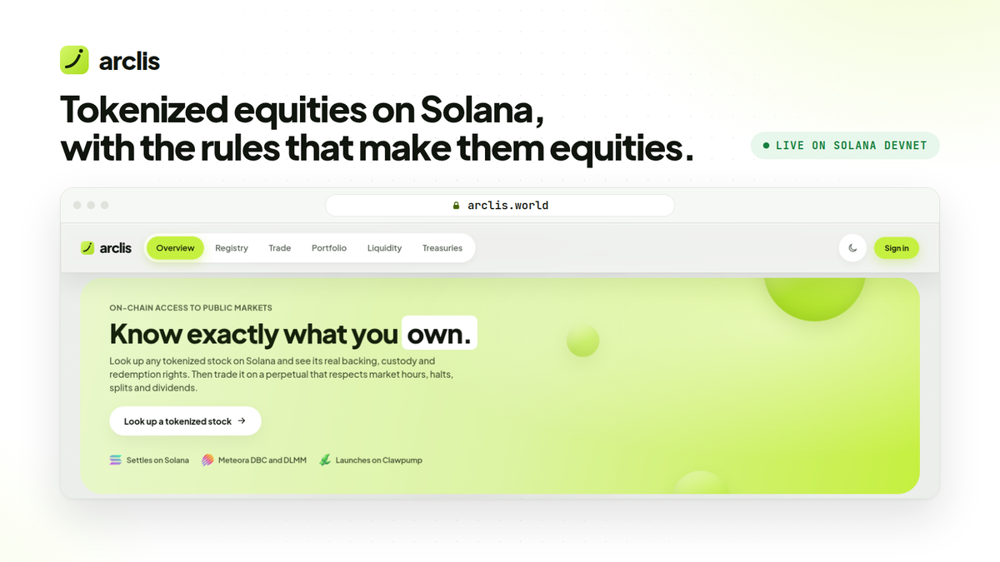
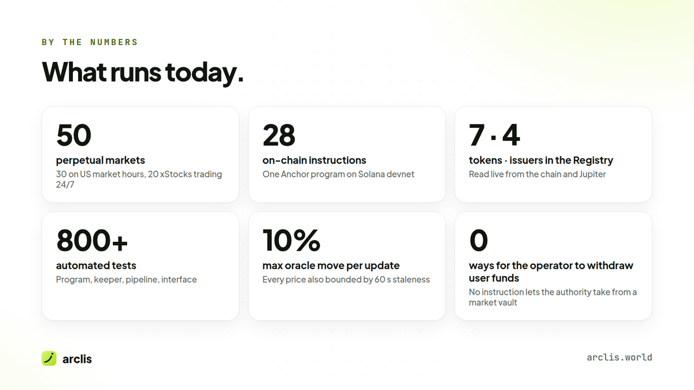
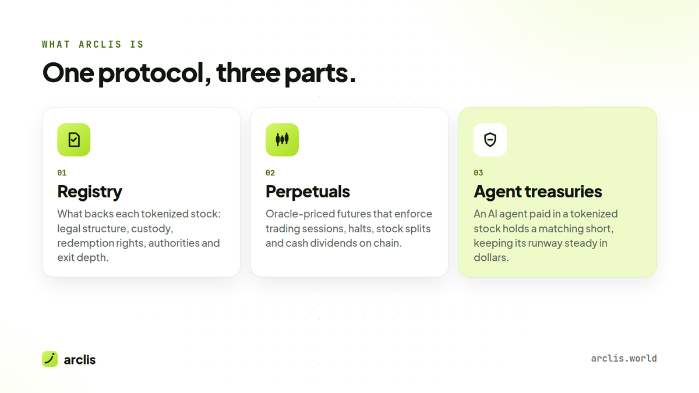
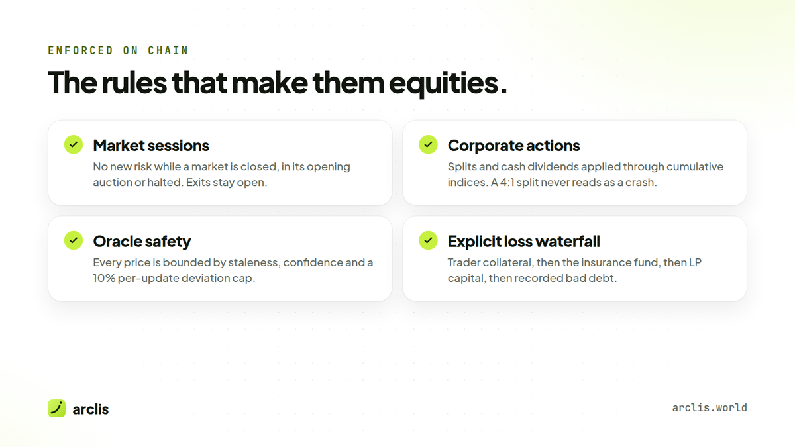

<p align="center">
  <a href="https://arclis.world"></a>
</p>

<h1 align="center">Arclis</h1>

<p align="center">
  <strong>Tokenized equities on Solana, with the rules that make them equities.</strong><br>
  A public registry of what each tokenized stock is backed by, perpetual futures
  that keep market hours, splits and dividends, and hedged treasuries for AI
  agents paid in stocks.
</p>

<p align="center">
  <a href="https://arclis.world"></a>
  
  
  
  <a href="LICENSE"></a>
</p>

<p align="center">
  <a href="https://arclis.world"><strong>Open the app</strong></a> ·
  <a href="https://arclis-keeper.fly.dev/registry">Registry data</a> ·
  <a href="https://arclis-keeper.fly.dev/health">Keeper health</a> ·
  <a href="https://explorer.solana.com/address/BuN69a1vsMdPQx6bWjaA7FJMbnBKo6yZ66cHrdyiTbiP?cluster=devnet">Program on Explorer</a> ·
  <a href="https://pump.fun/coin/74f7U4HTbcE4JKcog5aEcL9WycCEs8KD5RrDaMDavjtS">$ARCLIS</a>
</p>

> **Status:** live on Solana devnet. Not audited. Not for use with real funds.

## At a glance



| Number | What it is |
|---|---|
| **50** perpetual markets | 30 follow US market hours; 20 xStocks trade 24/7 |
| **28** on-chain instructions | One Anchor program, deployed on Solana devnet |
| **7** tokens, **4** issuers | In the Registry, read live from the chain and Jupiter |
| **800+** automated tests | Program, keeper, pipeline, interface and Meteora tooling |
| **10%** | Largest oracle move accepted in one update; every price also expires after 60 s |
| **0** | Instructions that let the authority withdraw from a market vault |

## What Arclis is



- **Registry.** A public lookup of what each tokenized stock on Solana actually
  is: issuer, legal structure, custodian, redemption rights, mint and freeze
  authorities, and how much can be sold before the price moves. It covers
  xStocks, Ondo Global Markets, Backpack Securities and PreStocks, reads every
  token live, links every issuer fact to its source, and needs no wallet.
- **Perpetuals.** Oracle-priced perpetual futures that enforce equity market
  rules on chain: trading sessions, halts, stock splits and cash dividends.
- **Agent treasuries.** An AI agent paid in a tokenized stock holds a matching
  short on the perpetual, keeping its runway steady in dollars. Rebalancing is
  permissionless.

## The rules, enforced on chain



- **Market sessions.** No new risk while a market is closed, in its opening
  auction or halted. Positions can still be closed while the market is closed,
  and idle collateral can be withdrawn at any time.
- **Corporate actions.** Splits and cash dividends are applied through
  cumulative indices, so a 4:1 split never reads as a 75% crash.
- **Oracle safety.** Every price is bounded by staleness, confidence and a 10%
  per-update deviation cap.
- **24/7 markets.** The 20 xStock markets are priced from the listed stock
  during US market hours and from the xStock's own Solana market otherwise; a
  market with no firm price is closed to new risk until one returns.
- **Explicit loss waterfall.** Trader collateral, then the insurance fund, then
  LP capital, then recorded bad debt.
- **Bounded operator powers.** Admin actions pause and unpause markets. Setup,
  liquidity pools and corporate actions are authority-signed, and no
  instruction lets the authority withdraw from a market vault
  (`programs/arclis/src/instructions/admin.rs`).

## Arclis Agent ($ARCLIS)

The first agent built on Arclis, launched on Pump.fun through ClawPump on
Solana mainnet. Its token trades against tokenized SPY, so its 1% creator fee
arrives in the stock, and an Arclis treasury is built to hedge that income back
to dollars.

| Field | Value |
|---|---|
| Mint | [`74f7U4HTbcE4JKcog5aEcL9WycCEs8KD5RrDaMDavjtS`](https://pump.fun/coin/74f7U4HTbcE4JKcog5aEcL9WycCEs8KD5RrDaMDavjtS) |
| Quote asset | Tokenized SPY (SPYx) |
| Creator fee | 1% of volume, paid in SPY |

The token is on mainnet; the hedging treasury runs on the Arclis program on
devnet, and mainnet hedging follows a security audit. Not financial advice.

## Live deployment

| Component | Location |
|---|---|
| Interface | [arclis.world](https://arclis.world), also served at [arclis.timioni1490.workers.dev](https://arclis.timioni1490.workers.dev) |
| Program (devnet) | [`BuN69a1vsMdPQx6bWjaA7FJMbnBKo6yZ66cHrdyiTbiP`](https://explorer.solana.com/address/BuN69a1vsMdPQx6bWjaA7FJMbnBKo6yZ66cHrdyiTbiP?cluster=devnet) |
| Keeper | [arclis-keeper.fly.dev/health](https://arclis-keeper.fly.dev/health) |
| Registry data | [arclis-keeper.fly.dev/registry](https://arclis-keeper.fly.dev/registry), rebuilt every 30 minutes |

The Registry needs no wallet. To trade or provide liquidity, connect a devnet
wallet and select **Get test USDC**; the faucet sends test USDC, and devnet SOL
for fees if the wallet has none.

## Architecture

| Path | Description |
|---|---|
| `programs/arclis/` | Anchor program (Rust): markets, positions, liquidity pools, oracles, insurance, corporate actions, agent treasuries. |
| `app/` | Interface (React, TypeScript, Vite), deployed on Cloudflare. Builds, simulates and signs transactions in the browser. |
| `keeper/` | Operations service on Fly.io: price and session publisher, funding crank, liquidator, treasury rebalancer, event indexer, market data, news, the live Registry and devnet faucet. |
| `pipeline/` | The Registry's curated issuer facts and the code that reads each token live from chain data and Jupiter quotes. |
| `src/dbc/` | Meteora Dynamic Bonding Curve configuration and monitoring for pools quoted in a tokenized stock. |
| `tools/clawpump/` | Agent token launches through the ClawPump partner API. |
| `server/` | Optional assistant endpoint for the interface (not deployed). |
| `scripts/` | Seeding, IDL generation, toolchain setup and verification. |
| `idl/` | The program's IDL, generated and committed. |

**How the pieces connect.** The keeper publishes prices and market sessions to
the program's oracles and runs the permissionless cranks. It also serves the
interface's read data over HTTP: a snapshot of every market account, price
history, daily bars, the event feed, headlines and the Registry. The interface falls back to
reading the chain directly when the keeper is unavailable. Wallets sign every
transaction; nothing that moves funds is signed server-side.

**Price sources.** Hours-bound markets are priced from Alpaca market data, with
Finnhub filling gaps. 24/7 markets use the same source during US market hours
and Jupiter quotes for the xStock otherwise; a market with no firm price is
closed to new risk until one returns.

## Getting started

### Prerequisites

- Node.js 22 (see `app/.nvmrc`)
- Rust (see `rust-toolchain.toml`)
- For on-chain work: Solana CLI 1.18 and Anchor 0.30.1

On Ubuntu or WSL, `bash scripts/setup-ubuntu.sh` installs the toolchain.
[`QUICKSTART.md`](QUICKSTART.md) is a guided setup, and
[`BUILD.md`](BUILD.md) covers toolchain details.

### Run the interface

```bash
npm install
npm --prefix app install
npm run app:dev            # http://localhost:5173, modelled data, no chain needed
```

### Run against a local validator

```bash
solana-test-validator --reset
anchor build --no-idl && anchor deploy
npm run seed -- --write-env   # config, markets, pools and sample positions
npm run app:dev
```

`anchor build --no-idl` avoids an Anchor 0.30.1 IDL-generation failure on
current Rust. The IDL is generated with `npm run idl` and committed under
`idl/`.

## Configuration

### Interface (`app/.env.*`, public at build time)

| Variable | Purpose |
|---|---|
| `VITE_DATA_SOURCE` | `rpc` for a deployment, `mock` for modelled data. |
| `VITE_CLUSTER`, `VITE_RPC_URL` | Cluster and RPC endpoint for wallet transactions. |
| `VITE_PROGRAM_ID`, `VITE_QUOTE_MINT` | Program and quote token addresses. |
| `VITE_MARKETS` | Symbols to show; must match `app/src/lib/markets.json`. |
| `VITE_KEEPER_URL` | Keeper base URL for snapshot, history, news and faucet. |
| `VITE_REFRESH_MS` | Read interval. |

Anything prefixed `VITE_` is shipped to the browser and must not be secret.

### Keeper (Fly.io secrets and `fly.toml`)

| Variable | Kind | Purpose |
|---|---|---|
| `KEEPER_KEYPAIR` | secret | Oracle authority and fee payer. |
| `RPC_URL` | secret | RPC endpoint for publishing. Any HTTP endpoint works; confirmation is polled, no websocket is required. An invalid value falls back to public devnet and is logged. |
| `ALPACA_KEY_ID`, `ALPACA_SECRET_KEY` | secret | Primary price feed. |
| `FINNHUB_API_KEY` | secret | Price gaps and headlines. |
| `JUPITER_API_KEY` | secret, optional | Jupiter API key for 24/7 markets; the keyless endpoint is used without it. |
| `READ_RPC_URL` | env | Endpoint for background reads (history backfill, event indexer). |
| `MARKETS` | env | Symbols to operate; must match `markets.json`. |
| `PRICE_INTERVAL_MS` | env | Publish interval; must stay inside the program's 60-second staleness bound. |
| `FAUCET_ENABLED` | env | `yes` serves test USDC at `POST /faucet`. Rate limited per wallet, per IP and per day. |
| `REGISTRY_RPC_URL` | env, optional | Mainnet endpoint for the Registry's mint reads; defaults to public mainnet. `REGISTRY_ENABLED=no` turns the Registry build off. |

HTTP endpoints: `/health`, `/snapshot`, `/history`, `/candles`, `/summary`,
`/events`, `/news`, `/registry` and `POST /faucet`. The health report shows each loop's
state, the RPC host (redacted) and the snapshot's age.

## Testing

| Suite | Tests | Command |
|---|---:|---|
| Program unit tests | 135 | `npm run test:unit` |
| Program integration (local validator) | 25 | `npm run test:integration` |
| Interface | 331 | `npm run app:test` |
| Keeper, pipeline and ClawPump tooling | 285 | `npm run keeper:test` |
| Meteora DBC tooling | 37 | `npm run test:dbc` |
| Type checks | | `npm run typecheck`, `npm run keeper:typecheck`, `npm --prefix app run typecheck` |

`bash scripts/verify.sh` runs the program, DBC and interface checks and prints
a plain-language summary. CI runs
formatting, Clippy, all of the above, a lockfile audit against the
platform-tools compiler, and the Anchor build.

## Deployment

| Component | How |
|---|---|
| Interface | Cloudflare builds and deploys `app/` on every push to `main` (`app/wrangler.jsonc`). |
| Keeper | `fly deploy --ha=false` from the repository root (`fly.toml`, `keeper/Dockerfile`). |
| Program | `anchor build --no-idl`, then `solana program deploy target/deploy/arclis.so --program-id <program id> --upgrade-authority <authority keypair>`. Toolchain notes in [`BUILD.md`](BUILD.md). |
| Markets | `npm run seed -- --url <rpc>` creates every market in `markets.json`. It is idempotent and never modifies a live market. |

Other operator commands: `npm run seed:treasury` opens a complete agent
treasury on devnet; `npm run clawpump -- pairs | snapshot | agents | launch`
drives ClawPump launches, reading the key from `CLAWPUMP_API_KEY`.

## Security

- The program has not been audited.
- The authority's complete powers are listed in
  `programs/arclis/src/instructions/admin.rs`.
- Every transaction is simulated before it is signed.
- API keys stay server-side; passkey account keys are stored in the browser
  only in encrypted form.
- The original program keypair was exposed in git history and has been
  rotated; see [`BUILD.md`](BUILD.md).

## Limitations

- **Oracle trust.** Prices come from a single keeper key, bounded by
  staleness, confidence and deviation checks.
- **24/7 liquidity.** Overnight, a 24/7 market is only as deep as the xStock's
  Solana liquidity.
- **Gap risk.** A large move across a market close can exceed the insurance
  fund before liquidation is possible.
- **Two clusters.** ClawPump launches run on mainnet and the treasury program
  on devnet, so a launched agent cannot yet be hedged end to end.
- **Corporate actions.** Mergers, spin-offs and delistings are not handled.

## Roadmap

1. A decentralised price feed in place of the keeper oracle authority.
2. Third-party security audit.
3. Mainnet deployment, so ClawPump-launched agents can be hedged end to end.
4. Volume and P&L history on top of the event indexer.

## Documentation

| Document | Contents |
|---|---|
| [`docs/ARCHITECTURE.md`](docs/ARCHITECTURE.md) | Accounts, instructions, PDA seeds and the read model. |
| [`docs/REGISTRY.md`](docs/REGISTRY.md) | Registry methodology. |
| [`docs/FEASIBILITY.md`](docs/FEASIBILITY.md) | Design risks and open questions. |
| [`docs/ENGINEERING-HISTORY.md`](docs/ENGINEERING-HISTORY.md) | Defects in the original draft and how they were fixed. |
| [`docs/HACKATHON.md`](docs/HACKATHON.md) | Mapping to the Stocklana hackathon tracks. |
| [`DESIGN.md`](DESIGN.md) | Interface design system. |
| [`article/ARTICLE.md`](article/ARTICLE.md) | Long-form write-up. |

## License

MIT. See [`LICENSE`](LICENSE).
